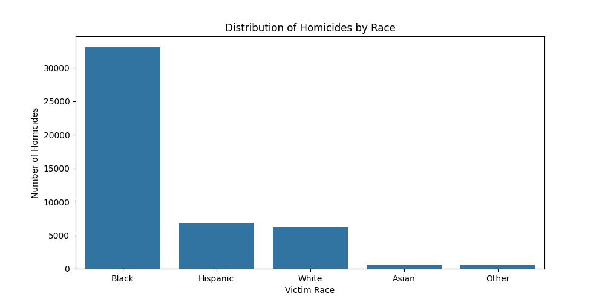
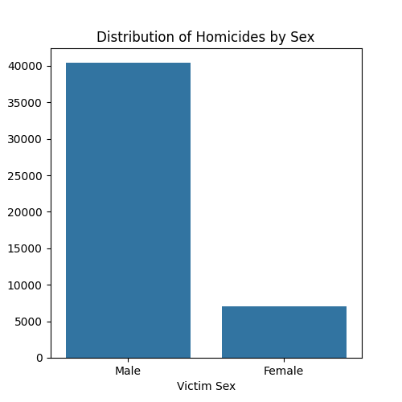
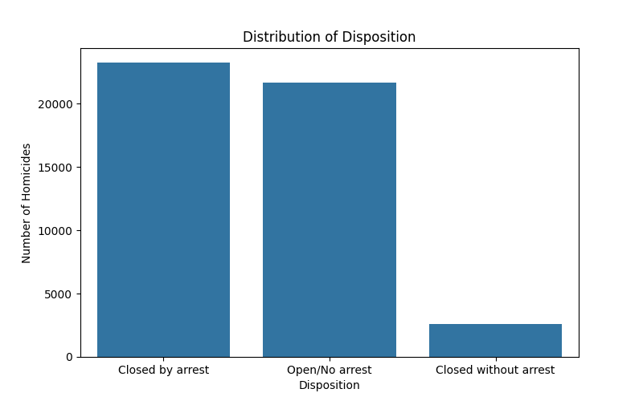
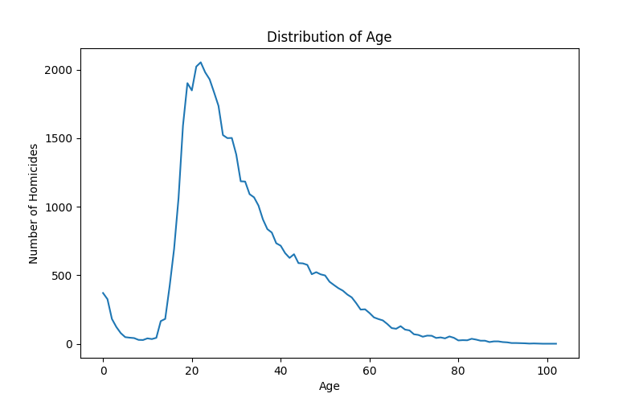
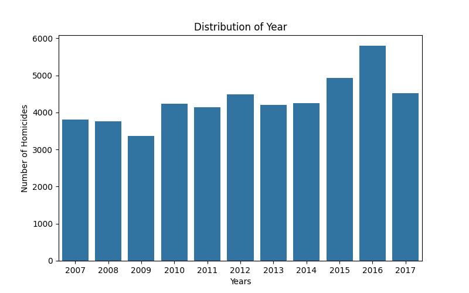
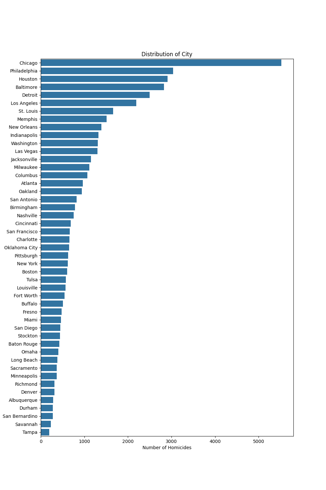
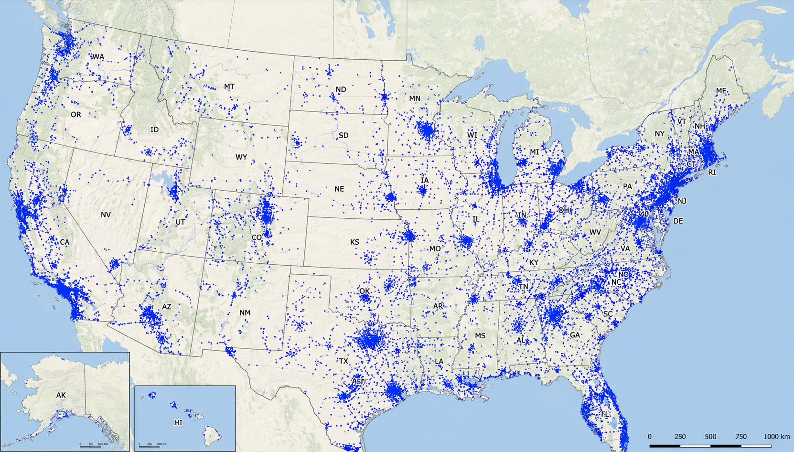
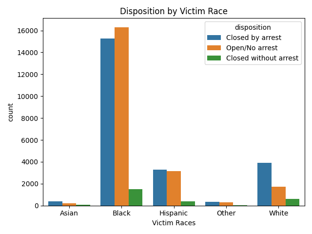
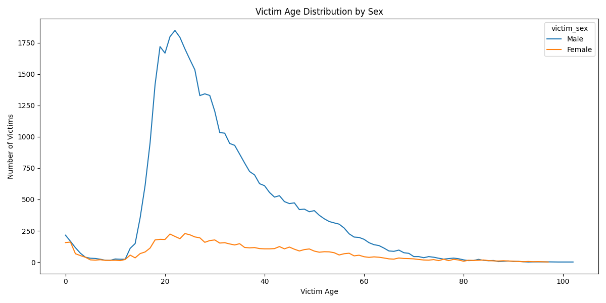

# Homicide Data Analysis and Geographic Visualization

## Project Overview

This project focuses on exploratory data analysis (EDA), data cleaning, statistical summarization, and geographic visualization of homicide records in the United States using Python and data science libraries.

The primary dataset contains homicide case information such as victim demographics, case disposition, city/state information, and geographic coordinates (latitude and longitude).

The objective of the project is to:

* preprocess and clean the raw dataset
* identify meaningful patterns in homicide records
* analyze relationships between demographic variables and case outcomes
* visualize homicide distributions across multiple dimensions
* map homicide locations geographically across the United States

---

## Dataset

### Source File

`homicide-data.csv`

### Main Attributes

The dataset includes the following key variables:

* `uid` → unique case identifier
* `reported_date` → date the homicide was reported
* `victim_first`, `victim_last` → victim name
* `victim_race` → victim race category
* `victim_age` → victim age
* `victim_sex` → victim gender
* `city`, `state` → homicide location
* `lat`, `lon` → geographic coordinates
* `disposition` → case resolution status

### Disposition Categories

* Closed by arrest
* Open / No arrest
* Closed without arrest

---

## Data Preprocessing

Several preprocessing operations were applied to improve data quality and ensure analytical consistency.

### 1. Missing Value Handling

Rows containing null values in the following columns were removed:

* `victim_last`
* `lat`
* `lon`

Additionally:

* non-numeric values in `victim_age` were converted using `pd.to_numeric()`
* rows with invalid age values were removed

### 2. Data Type Conversion

* `victim_age` → converted from string to integer
* `reported_date` → converted to `datetime` format using `pd.to_datetime()`

### 3. Text Standardization

String formatting was normalized using:

* `.str.title()`
* `.str.strip()`

for the following fields:

* victim names
* race values

### 4. Feature Engineering

A new categorical feature was created:

### `victim_old`

Victims were grouped into age classes:

* `Child` → age < 18
* `Adult` → 18–65
* `Old` → age > 65

### 5. Unknown Category Removal

Rows containing `Unknown` values in:

* `victim_sex`
* `victim_race`

were excluded from the final analysis.

---

## Exploratory Data Analysis (EDA)

Descriptive statistics were generated using:

* `head()`
* `describe()`
* `info()`
* `isnull()`
* `value_counts()`
* `groupby()`

This allowed identification of:

* race distribution
* sex distribution
* city-based homicide concentration
* age patterns
* case resolution statistics
* geographic spread of incidents

---

## Visualizations

The following visual outputs were generated during the exploratory data analysis process. Each visualization helps interpret homicide patterns from a different analytical perspective.

---

### 1. Homicides by Race

`homicides_by_race.png`

This bar chart shows the distribution of homicide victims based on race categories. It highlights that Black victims represent the largest proportion in the dataset, followed by Hispanic and White victims.

---

### 2. Homicides by Sex

`homicides_by_sex.png`

This visualization compares homicide victim counts by gender. Male victims significantly outnumber female victims across the dataset.

---

### 3. Disposition Distribution

`homicides_by_disposition.png`

This graph illustrates the case resolution outcomes. Most homicide cases fall into either "Closed by arrest" or "Open / No arrest," while "Closed without arrest" appears less frequently.

---

### 4. Age Distribution

`homicides_by_age.png`

This line plot presents homicide frequency by victim age. It helps identify the age ranges where homicide victimization is most concentrated.

---

### 5. Yearly Distribution

`homicides_by_year.png`

This bar chart shows the number of homicide cases reported by year, allowing temporal trend analysis across the dataset.

---

### 6. City-Based Distribution

`homicides_by_city.png`

This horizontal bar chart displays homicide concentration by city. Major cities such as Chicago, Philadelphia, Houston, Baltimore, and Detroit show the highest homicide counts.

---

### 7. Geographic Visualization of Homicide Locations

`abd_map.png`

This map was created using the latitude and longitude coordinates extracted from the dataset. Each point represents a homicide location within U.S. borders. This visualization provides spatial insight into homicide clustering and regional crime density.

---

## Additional Analytical Relationships

Multiple visualizations were created using:

* `matplotlib`
* `seaborn`

---

## Relationship Analysis

Additional grouped analyses were performed to investigate deeper relationships between variables.

### Race vs Disposition

Examines whether homicide resolution outcomes vary by victim race.

### Sex vs Age Group

Analyzes child/adult/elderly victim distribution across ages.

---

## Geographic Visualization

A separate geographic dataset was created using only:

* `lat`
* `lon`

columns.

### File

`location.csv`

This coordinate-only dataset was used for spatial visualization.

Each latitude–longitude pair represents a homicide location within U.S. boundaries.

The coordinates were processed to generate:

### `abd_map.png`

This map visualizes homicide locations directly on the map of the United States using point-based geographic plotting.

This visualization helps identify:

* regional homicide density
* metropolitan clustering
* high-frequency urban crime zones
* nationwide spatial distribution patterns

This significantly improves the project by combining statistical analysis with geospatial insight.

---

## Technologies Used

### Programming Language

* Python

### Libraries

* pandas
* matplotlib
* seaborn

### Additional Visualization Support

* AI-assisted geographic plotting for U.S. coordinate mapping

---

## Project Outcomes

This project demonstrates:

* practical data cleaning
* feature engineering
* exploratory data analysis
* statistical interpretation
* grouped relational analysis
* visualization design
* geographic data representation

The combination of demographic analysis and map-based visualization provides both analytical and spatial understanding of homicide patterns across the United States.

---

## Future Improvements

Potential future extensions include:

* state-level heatmaps
* interactive dashboards using Plotly or Tableau
* predictive modeling for case disposition
* clustering analysis for homicide hotspots
* correlation heatmaps
* machine learning classification models

---

## Author
***Elif Asya Tanrıvere***

Computer Engineering Student

Data Analysis Project – Criminal/Homicide Dataset Analysis
